<h1 align="center">
    <b>
         
        # Tugas Besar 1 IF3110 Pengembangan Aplikasi Berbasis Web
         
    </b>
</h1>

<h2 align="center">
    <b>
         
        Engima
         
         
    </b>
</h2>

## Deskripsi Singkat

Saat ini Engi ingin melakukan ekspansi usaha dengan membangun sebuah bioskop. Setelah berdiri selama 2 bulan, Engi merasa bioskopnya sepi dibanding bioskop kompetitor lainnya. Usut punya usut, ternyata faktor utama penyebab sepinya bioskop Engi adalah tidak adanya kemudahan pemesanan tiket secara daring. Oleh karena itu, Engi meminta Anda untuk membuat aplikasi web pemesanan tiket bioskop daring. Engi menginginkan website miliknya untuk memiliki fitur pembelian tiket, memberi ulasan pada film yang telah ditonton, login dan register, riwayat pembelian tiket.

Engi telah mempekerjakan seorang UI/UX profesional untuk mendesain tampilan *website*-nya. Anda diminta untuk mengimplementasikan tampilan sedemikian mirip dengan tampilan pada contoh. Engi tidak meminta Anda untuk membangun *website* yang *responsive*. Icon dan jenis font tidak harus sama dengan contoh. Tata letak elemen, warna font, garis pemisah, dan perbedaan ukuran font harus terlihat sesuai contoh. Format rating dan waktu harus terlihat sesuai contoh tampilan.

Website ini dibuat dengan menggunakan Javascript, HTML dan CSS untuk frontend dan menggunakan bahasa PHP untuk backend serta MySQL untuk penyimpanan data.

## Requirement
| Nomor | Requirement                | Penjelasan                                                   |
|:-----:|:---------------------------|:-------------------------------------------------------------|
| 1.    | XAMPP                      | Dibutuhkan untuk menjalankan database MySQL                  |
| 2.    | PHP                        | Dibutuhkan untuk menjalankan program backend engima          |
| 3.    | Browser (support html 2.0) | Dibutuhkan sebagai sarana utama menjalankan frontend Engima  |
 

## Cara Instalasi
1. Download/Clone Engima dari git pada folder engi_cinema
2. Pastikan posisi folder engi_cinema berada pada path ..\xampp\htdocs\
3. Jalankan modul Apache dan MySQL pada XAMPP
4. Jalankan http://localhost/engi_cinema/ pada browser pilihan

 

## Cara Menjalankan Server
1. Jalankan modul Apache dan MySQL pada XAMPP
2. Pastikan folder engi_cinema berada pada path ..\xampp\htdocs\

 

## Screenshots

### Login page

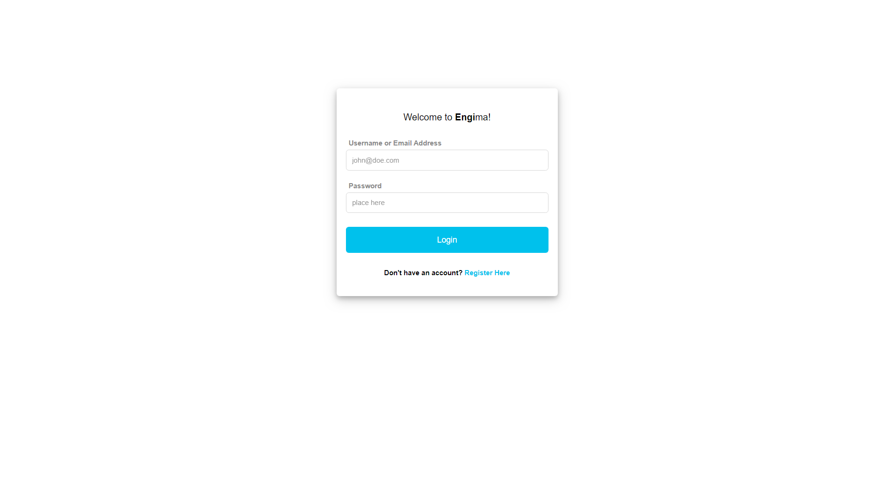
 
 
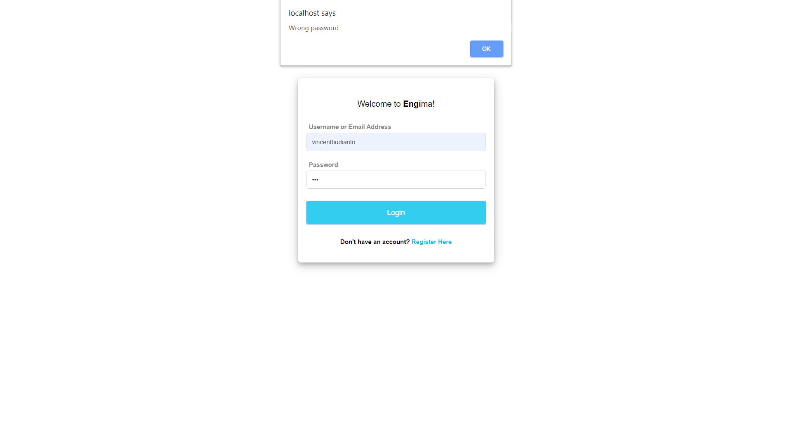
 
 
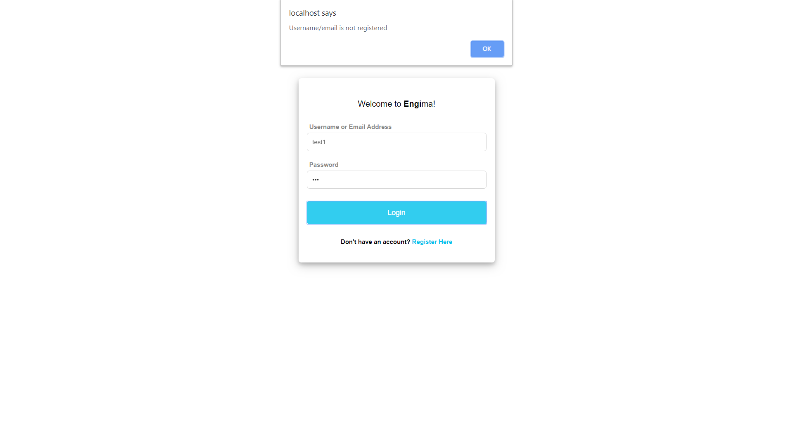
 
 

### Register page

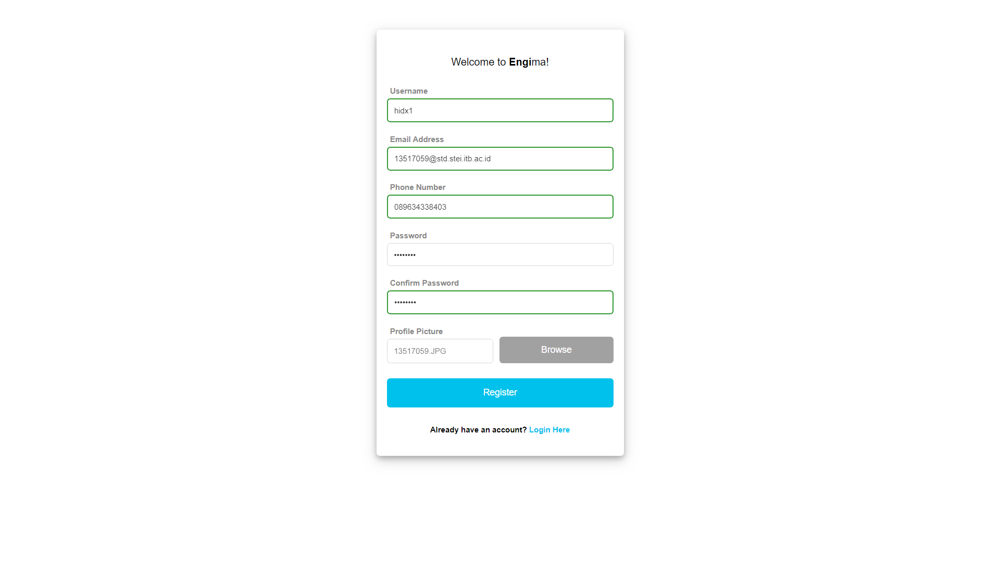
 
 
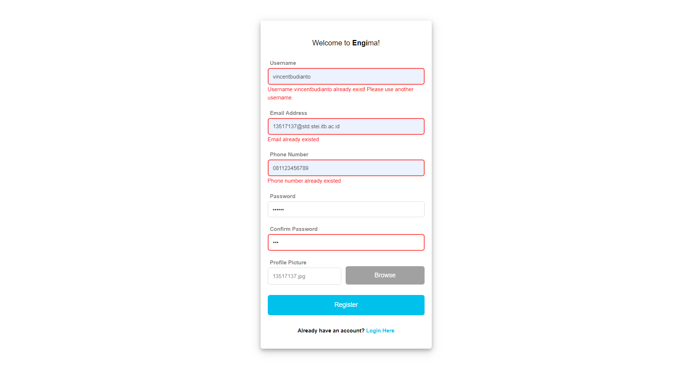

### Home page

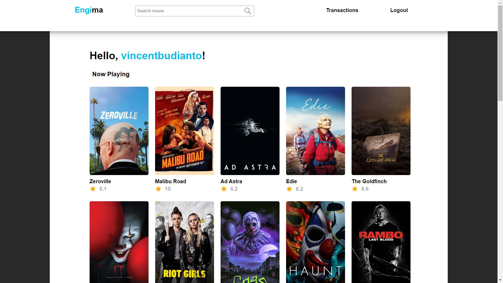
 
 

### Search Result page

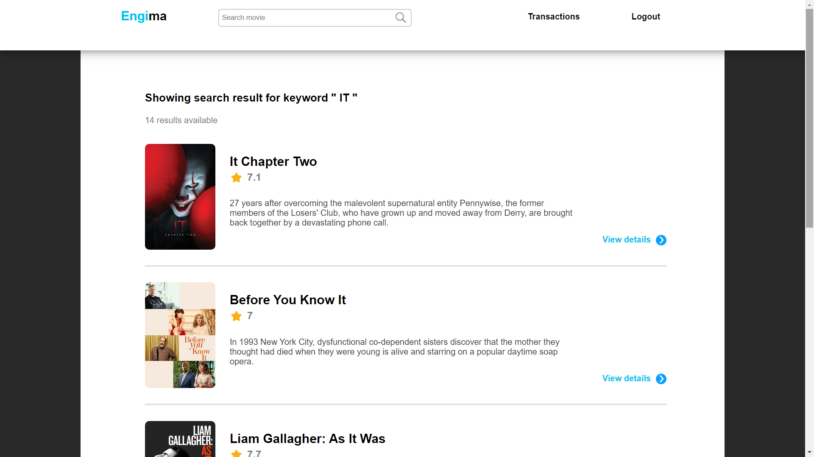
 
 
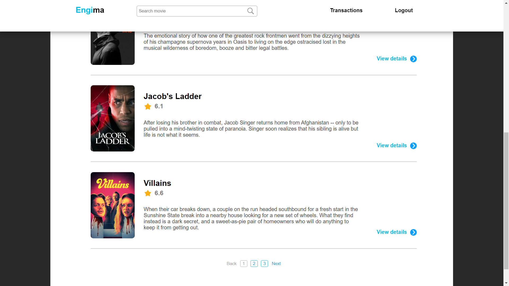
 
 
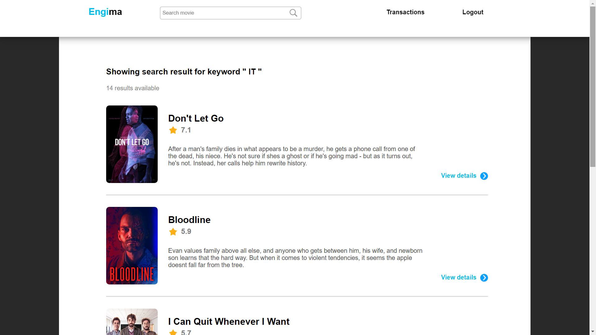
 
 
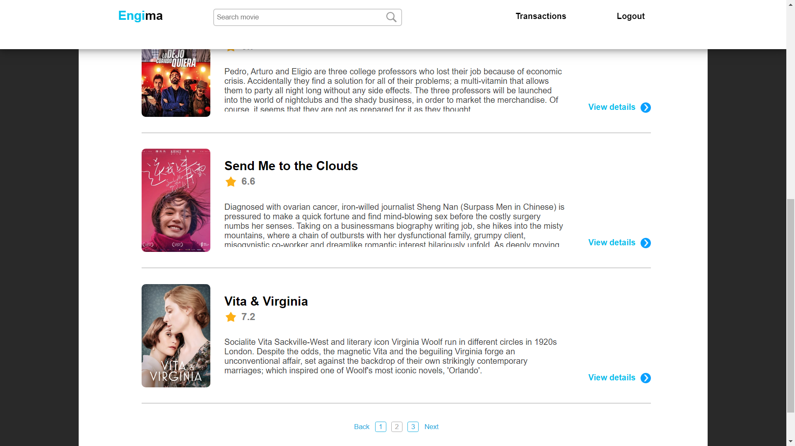
 
 
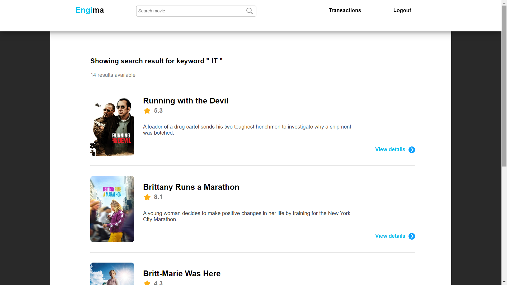
 
 
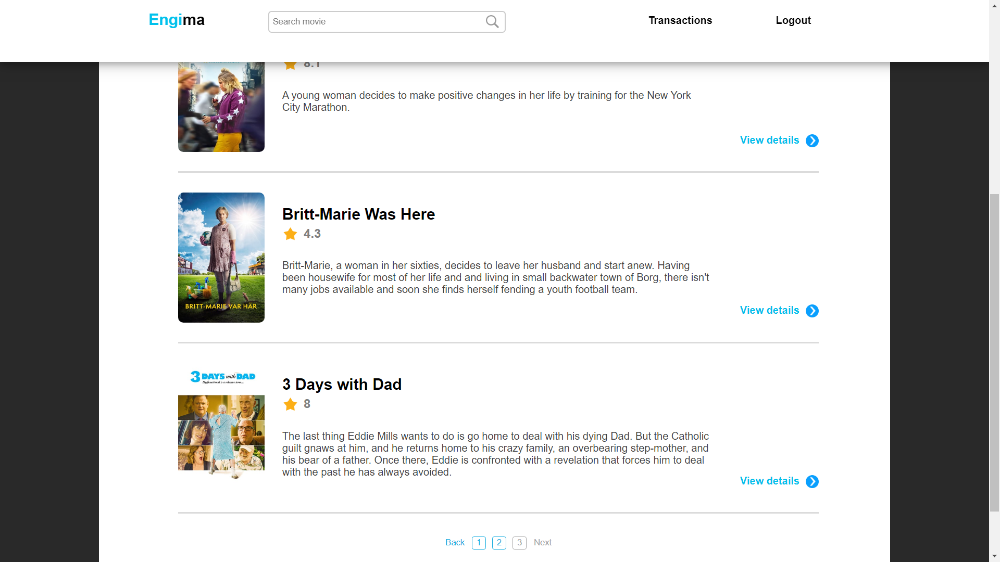
 
 

### Film Detail page

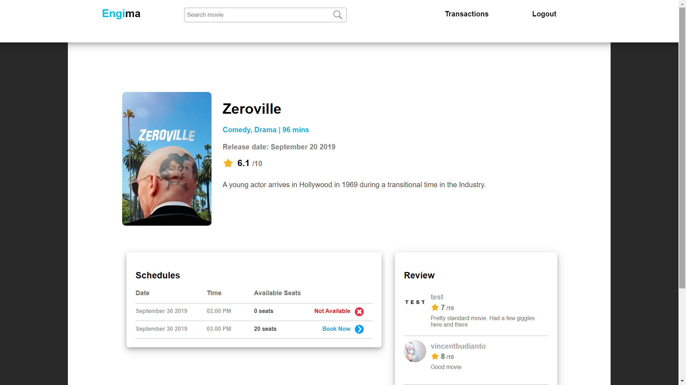
 
 

### Buy Ticket page

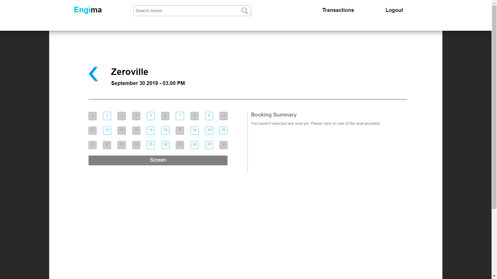
 
 
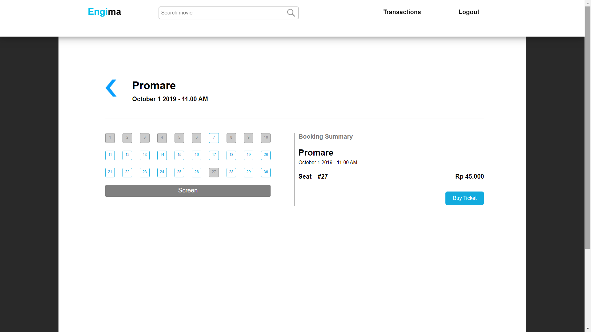
 
 
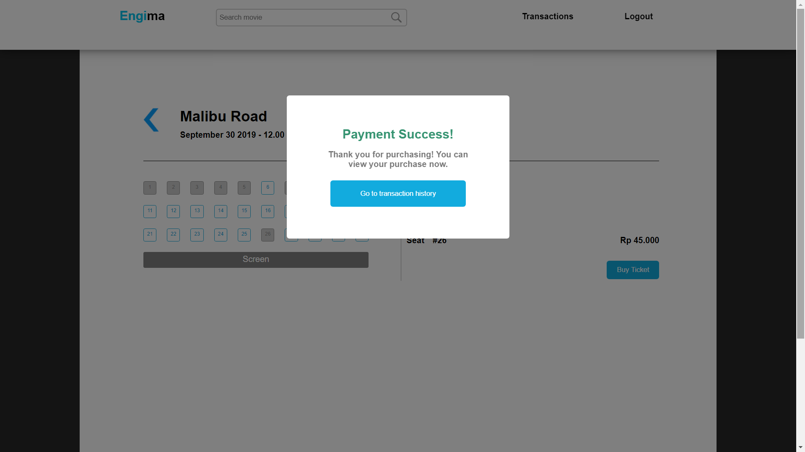
 
 

### Transaction History page

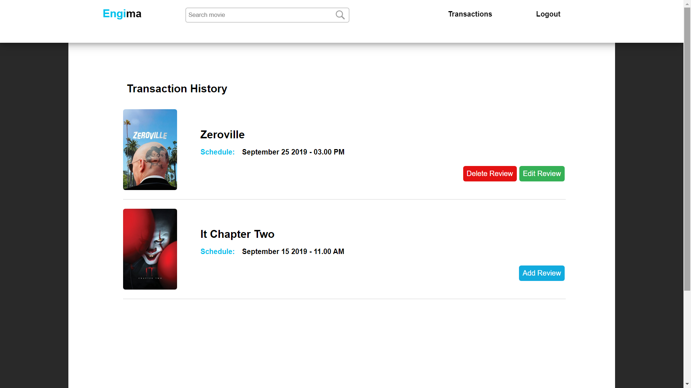
 
 

### User Review page

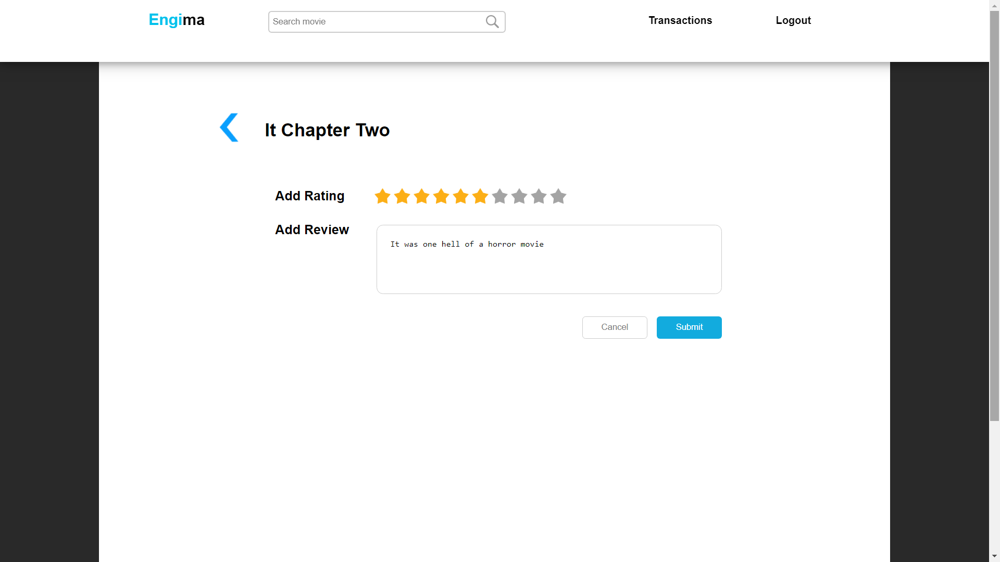
 
 

 

## Keterangan Tambahan

* Jam pada aplikasi web mengacu pada jam lokal pengguna.
* Basis data menggunakan MySQL.

## Knowledge

Beberapa teknik yang digunakan pada pengerjaan tugas kali ini

|              | Kata Kunci                                                                           |
| ------------ | ------------------------------------------------------------------------------------ |
| HTTP methods | get, post, put, delete, response, onload                                             |
| CSS          | margin, padding, font-size, text-align, flex, grid, border, color, div, span         |
| Javascript   | XMLHTTPRequest, addEventListener, FormData, createElement, appendChild, parentNode   |
| PHP          | PDO, $_GET, $_POST, $_COOKIE, var_dump, print_r, echo, require, fungsi header        |
| SQL query    | SELECT, INSERT, UPDATE, DELETE, WHERE, operator LIKE                                 |

## Pembagian Tugas

### Frontend
| Number | Feature     | Assignment         |
|:------:|:------------|:-------------------|
| 1.     | Detail      | 13517059           |
| 2.     | Homepage    | 13517059           |
| 3.     | Login       | 13517044, 13517137 |
| 4.     | Register    | 13517059, 13517137 |
| 5.     | Review      | 13517137           |
| 6.     | Search      | 13517059, 13517137 |
| 7.     | Ticket      | 13517059           |
| 8.     | Transaction | 13517059           |

### Backend
| Number | Feature     | Assignment         |
|:------:|:------------|:-------------------|
| 1.     | Detail      | 13517059           |
| 2.     | Homepage    | 13517059           |
| 3.     | Login       | 13517137           |
| 4.     | Logout      | 13517137           |
| 5.     | Register    | 13517137           |
| 6.     | Review      | 13517137           |
| 7.     | Search      | 13517137           |
| 8.     | Ticket      | 13517059           |
| 9.     | Transaction | 13517059           |

### README
| Number | Feature                 | Assignment         |
|:------:|:------------------------|:-------------------|
| 1.     | Deskripsi               | 13517137           |
| 2.     | Requirement             | 13517059, 13517137 |
| 3.     | Cara Installasi         | 13517059, 13517137 |
| 4.     | Cara Menjalankan Server | 13517137           |
| 5.     | Screenshots             | 13517137           |
| 6.     | Keterangan Tambahan     | 13517137           |
| 7.     | Knowledge               | 13517137           |

    <b>
         
        
            About
        
    </b>

    <b>
        IF3110-Pengembangan Aplikasi Berbasis Web - 2019
         
        Teknik Informatika 2017
         
         
        13517044 - Ignatius Timothy Manulang
         
        13517059 - Nixon Andhika
         
        13517137 - Vincent Budianto
    </b>

