# Tugas 1 IF3110 Pengembangan Aplikasi Berbasis Web (Engi-s-Cinema)

## Deskripsi Singkat

Saat ini Engi ingin melakukan ekspansi usaha dengan membangun sebuah bioskop. Setelah berdiri selama 2 bulan, Engi merasa bioskopnya sepi dibanding bioskop kompetitor lainnya. Usut punya usut, ternyata faktor utama penyebab sepinya bioskop Engi adalah tidak adanya kemudahan pemesanan tiket secara daring. Oleh karena itu, Engi meminta Anda untuk membuat aplikasi web pemesanan tiket bioskop daring. Engi menginginkan website miliknya untuk memiliki fitur pembelian tiket, memberi ulasan pada film yang telah ditonton, login dan register, riwayat pembelian tiket.

Engi telah mempekerjakan seorang UI/UX profesional untuk mendesain tampilan *website*-nya. Anda diminta untuk mengimplementasikan tampilan sedemikian mirip dengan tampilan pada contoh. Engi tidak meminta Anda untuk membangun *website* yang *responsive*. Icon dan jenis font tidak harus sama dengan contoh. Tata letak elemen, warna font, garis pemisah, dan perbedaan ukuran font harus terlihat sesuai contoh. Format rating dan waktu harus terlihat sesuai contoh tampilan.

## Tools

* Untuk frontend, gunakan Javascript, HTML dan CSS. **Tidak boleh** menggunakan *library* atau *framework* CSS atau JS (e.g. JQuery, lodash, atau Bootstrap). CSS sebisa mungkin ada di file yang berbeda dengan HTML (tidak *inline styling*).
* Untuk backend, wajib menggunakan **PHP tanpa framework apapun**. Harap diperhatikan, Anda harus mengimplementasikan fitur menggunakan HTTP *method* yang tepat.
* Gunakan **MySQL** untuk menyimpan data.

## Spesifikasi

### Login page

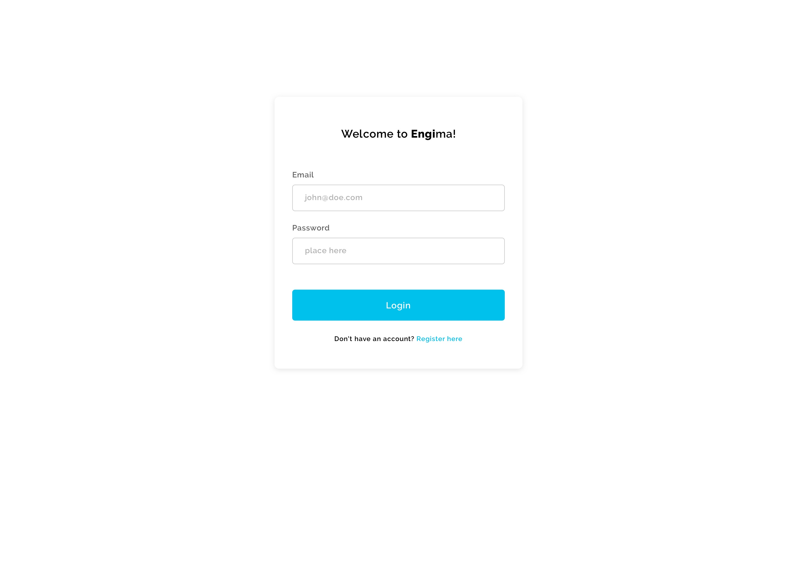

Halaman pertama yang ditampilkan jika pengguna belum *login* atau sudah *logout* adalah halaman **Login**. Pengguna dapat melakukan *login* sebagai *user*. *Login* hanya membandingkan email dan password saja. Tidak perlu tambahan proteksi apapun.

Identitas pengguna yang sudah *login* akan disimpan sebagai ***cookie*** dalam browser. *Cookie* menyimpan data pengguna dalam bentuk *string* dengan panjang tertentu. Untuk mengetahui pengguna mana yang sedang *login*, *string* tersebut dapat dilihat di basis data. **Identitas tersebut tidak boleh disimpan sebagai parameter HTTP GET**. Jika *cookie* ini tidak ada, maka pengguna dianggap belum login dan aplikasi akan selalu mengarahkan (*redirect*) pengguna ke halaman ini, meskipun pengguna membuka halaman yang lain. Masa berlaku *cookie* ditentukan sendiri oleh peserta.

### Register page

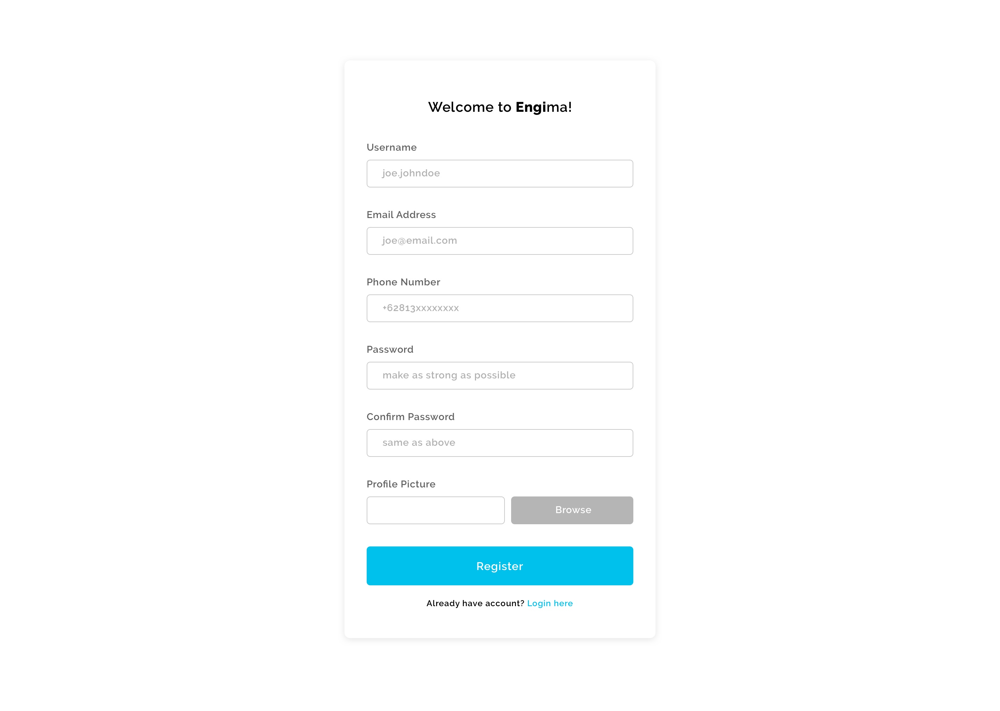

Pengguna dapat mendaftarkan akun baru jika belum *login* atau sudah *logout*. Pada halaman ini, pengguna mendaftarkan diri dengan email, username, dan nomor hp yang **unik**. Pengecekan keunikan nilai *field* dilakukan menggunakan AJAX. Jika unik, border *field* akan berwarna hijau. Jika tidak unik, *field* akan diberikan pesan error seperti berikut.

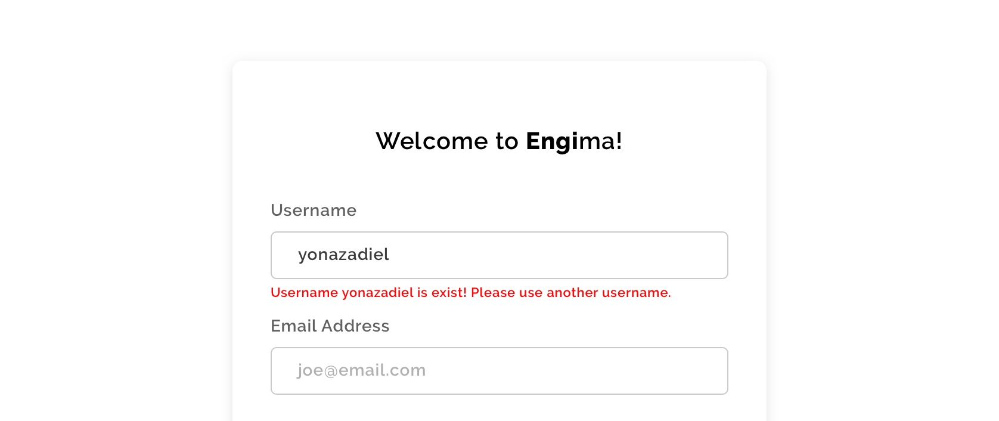

Validasi lain yang dilakukan pada **sisi klien** pada halaman ini adalah:

* Email sesuai memiliki format email standar seperti “user@mail.com”.
* Username hanya menerima kombinasi alphabet, angka, dan *underscore*.
* Nomor HP hanya menerima angka dengan panjang antara 9-12 angka.

Setelah semua nilai *field* sudah diisi dan valid, pengguna dapat mendaftarkan akun barunya. Jika akun berhasil didaftarkan, pengguna langsung diarahkan ke halaman **Home**. Mekanisme *cookie* sama dengan halaman **Login**.

### Home page

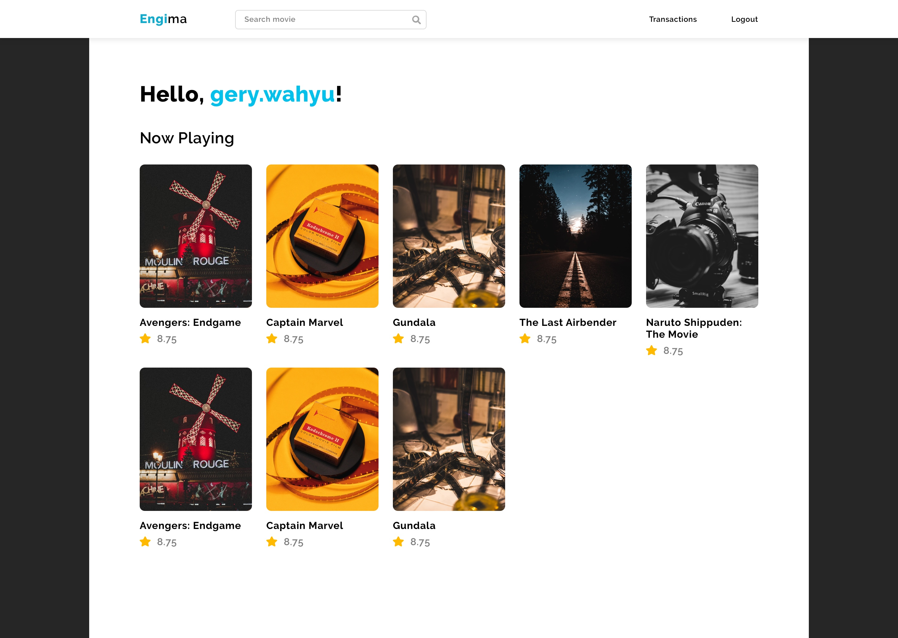

Pada halaman **Home**, pengguna disambut dengan *username* pengguna dan daftar film yang sedang tayang. Film yang sedang tayang adalah film yang mempunyai jadwal saat waktu sekarang. Pengguna dapat melihat detail film dengan mengklik poster atau judul film.

Header aplikasi web terdiri dari *search bar* dan pilihan untuk *logout*. Search bar digunakan untuk mencari film berdasarkan judul. Hasil pencarian ditampilkan pada halaman **Search Result**. Jika pengguna memilih untuk *logout*, halaman akan diarahkan ke halaman **Login**.

### Search Result page

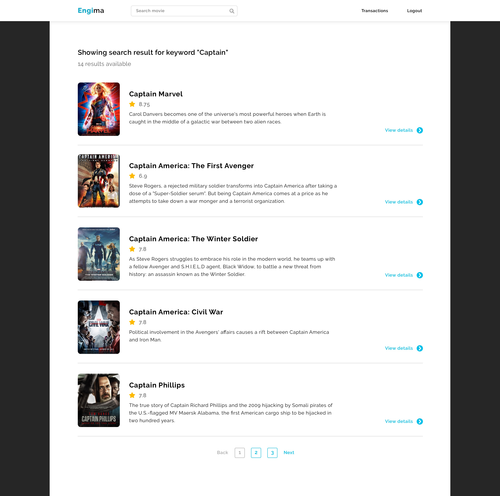

Hasil pencarian dari *search bar* di halaman Home akan ditampilkan pada halaman ini. Untuk setiap film, ditampilkan informasi judul, sinopsis, rating, poster. Pengguna dapat melihat detail film dengan mengklik tombol “View details”.

Jika daftar film melebihi jumlah tertentu (jumlah didefinisikan sendiri), maka akan muncul *pagination* untuk melihat daftar film selebihnya. Ketika memilih *page*, pengguna tidak diarahkan ke halaman baru namun daftar film langsung berubah di halaman ini.

### Film Detail page

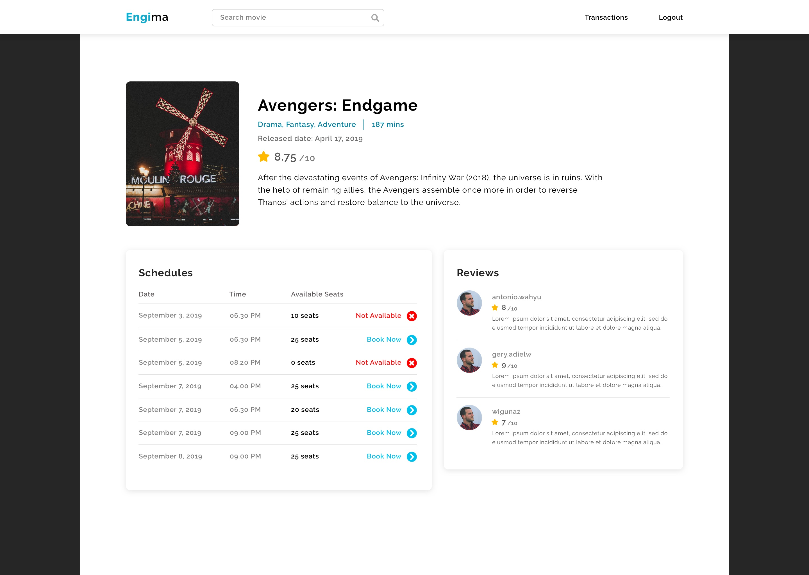

Pada halaman **Film Detail**, terdapat beberapa informasi mengenai film yang dipilih, yaitu judul, poster, rating, genre (bisa lebih dari satu), tanggal rilis, durasi tayang (dalam menit), dan sinopsis dari film tersebut.

Pengguna dapat melihat ulasan film tersebut dari pengguna yang telah membeli tiket film tersebut. Informasi setiap review meliputi *username*, foto pengguna yang memberikan ulasan, penilaian bintang (dalam skala 1-10), dan ulasan yang diberikan mengenai film tersebut.

Pembelian tiket bioskop dapat dibeli di halaman ini juga. Pengguna memilih tanggal dan jam tayang yang belum lewat dari waktu sekarang. Jika tiket untuk suatu jadwal sudah habis, maka akan muncul “Not Available”. Jika masih ada kursi yang tersedia, pengguna dapat memilih tombol “Book Now” yang kemudian mengarahkan ke halaman **Buy Ticket**.

### Buy Ticket page

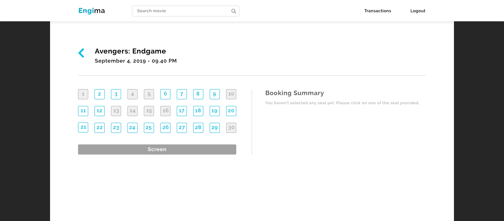

Setelah memilih jadwal tayang film, pengguna memilih posisi kursi. Untuk setiap pembelian, pengguna hanya dapat **membeli 1 kursi**. Pengguna tidak dapat memilih kursi yang telah dibeli oleh pengguna lain. Kursi yang tersedia berwarna biru dan yang tidak tersedia berwarna abu-abu. (Asumsi saat pembelian tiket, ketersediaan kursi tidak berubah).

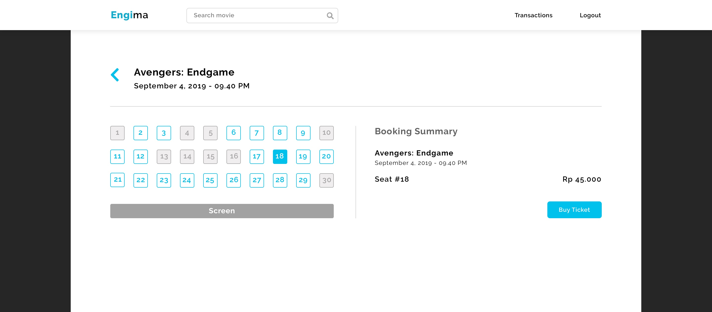

“Booking Summary” akan muncul ketika pengguna sudah memilih posisi kursi. Pengguna dapat membeli tiket dengan menekan tombol “Buy Ticket”.

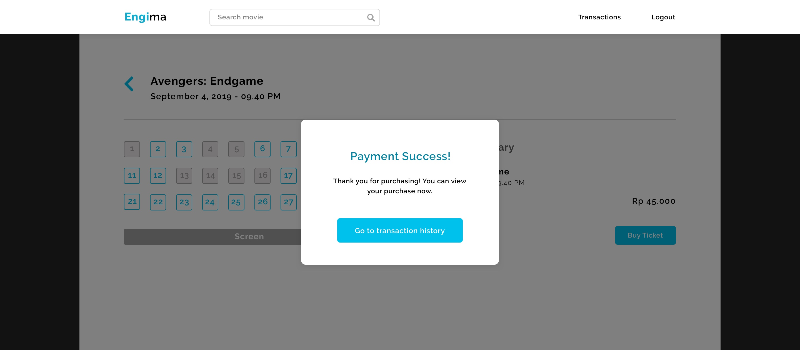

Sebuah modal akan muncul untuk memberitahukan apakah tiketnya berhasil dibeli atau tidak. Modal hanya muncul jika **sudah ada konfirmasi keberhasilan/kegagalan dari *response* AJAX**. Menutup modal tersebut akan mengarahkan pengguna ke halaman **Transaction History**.

### Transaction History page

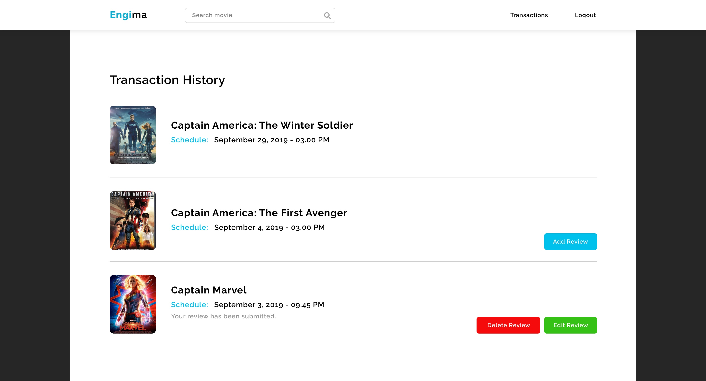

Pada halaman ini, ditampilkan daftar film yang telah dipesan dan telah ditonton (jadwal tayang telah lewat) maupun yang belum (jadwal tayang di masa depan). Daftar diurutkan **berdasarkan waktu jadwal tayang** dengan jadwal tayang paling terakhir merupakan entri paling atas.

Ulasan baru dapat dilakukan ketika tiket yang telah dibeli telah lewat jadwal tayangnya. Sebagai contoh sekarang tanggal 1 September 12.00, Engi membeli tiket untuk tanggal 2 September pukul 14.00, maka Engi baru bisa memberikan ulasan setelah tanggal 2 September pukul 14.00. Ulasan yang telah ditulis dapat diubah ataupun dihapus. Ulasan hanya dapat diberikan sekali untuk setiap pembelian tiket. Setelah ulasan dihapus, pengguna dapat memberikan ulasan baru.

Pada setiap entri pada *history*:

* Jika jadwal tayang film belum terlewat maka tidak pengguna tidak dapat menambah review
* Jika jadwal tayang film telah lewat, maka:
  * Jika belum memberikan ulasan maka muncul tombol “Add Review”
  * Jika sudah memberikan ulasan maka muncul tombol “Edit Review” dan tombol “Delete Review”

### User Review page

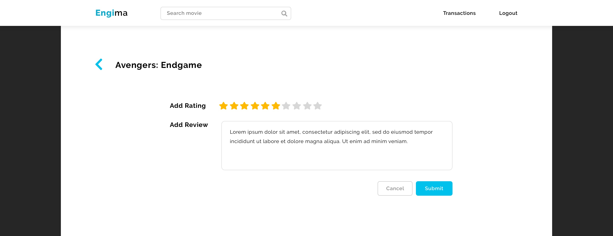

Pengguna menulis ulasan film pada halaman ini. Pengguna dapat memberikan ulasan dalam bentuk pilihan rating dalam skala 1-10 dan deskripsi ulasan.

Jika pengguna belum pernah mengulas film tersebut atau telah menghapus ulasannya, pengguna dapat memberikan ulasannya dengan tombol "Submit" atau membatalkan ulasan dengan menekan tombol "Cancel". Jika pengguna telah memberikan ulasan dan belum dihapus, akan ada tombol "Submit" digantikan dengan tombol "Edit" untuk mengubah ulasan. Saat pengguna akan mengubah ulasan, informasi rating dan deskripsi ulasan akan muncul pada halaman ini.

## Keterangan Tambahan

* Jam pada aplikasi web mengacu pada jam lokal pengguna.
* Basis data didefinisikan sendiri.

## Bonus

*Catatan: Kerjakan dahulu spesifikasi wajib sebelum mengerjakan bonus.*

1. Data yang disimpan pada cookie memiliki *expiry time*. Jika *access token* ini tidak ada atau tidak valid, maka pengguna dianggap belum *login*. *Expiry time* sebuah *access token* berbeda dengan waktu berlaku cookie.
2. Pada halaman **Buy Ticket**, ketersediaan kursi diperbaharui secara *real-time*. Contoh jika pengguna A memilih kursi 1 dan ternyata pengguna B telah membeli kursi tersebut, maka ketersediaan kursi perlu diperbaharui. Akibatnya, pengguna A tidak dapat membeli kursi 1. Pembaharuan ketersediaan kursi menggunakan AJAX.
3. Tampilan dibuat responsif (minimal untuk ukuran 1280x768 dan 800x600). Artinya, tampilan mungkin berubah menyesuaikan ukuran layar.

## Knowledge

Untuk meringankan beban tugas ini, ada beberapa *keyword* yang bisa Anda cari untuk menyelesaikan tugas ini.

|              | Kata Kunci                                                                                            |
| ------------ | ----------------------------------------------------------------------------------------------------- |
| HTTP methods | get, post, put, delete                                                                                |
| CSS          | margin, padding, font-size, text-align, flex, grid, border, color, div, span, anchor tag, box-shadow  |
| Javascript   | XMLHTTPRequest, addEventListener                                                                      |
| PHP          | mysqli_connect, mysql_query, $_GET, $_POST, $_COOKIE, var_dump, print_r, echo, require, fungsi header |
| SQL query    | SELECT, INSERT, UPDATE, DELETE, WHERE, operator LIKE                                                  |

Jika ada pertanyaan, silahkan tanya lewat sheet ini: https://docs.google.com/spreadsheets/d/138nSoyPRBhrIZersCjrHzOmW5CevxXj94x-FslHQ1Zs/edit?usp=sharing

## Anggota Tim
Anggota tim dapat dilihat di sheet ini: https://docs.google.com/spreadsheets/d/1u46VRn_9sAVn2TV5SverJWrTN4KKnAFJ6bCGM-cjvUc/edit?usp=sharing.

## Petunjuk Pengerjaan

1. Buatlah grup pada Gitlab dengan format "IF3110-2019-01-KXX-YY", dengan **XX** adalah nomor kelas dan **YY** adalah nomor kelompok.
2. Tambahkan anggota tim pada grup anda.
3. Fork pada repository ini dengan grup yang telah dibuat.
4. Ubah hak akses repository hasil Fork anda menjadi private.
5. Silakan commit pada repository anda (hasil fork). Lakukan beberapa commit dengan pesan yang bermakna, contoh: `add register form`, `fix logout bug`, jangan seperti `final`, `benerin dikit`, `fix bug`. Disarankan untuk tidak melakukan commit dengan perubahan yang besar karena akan mempengaruhi penilaian (contoh: hanya melakukan satu commit kemudian dikumpulkan). Sebaiknya commit dilakukan setiap ada penambahan fitur. Commit dari setiap anggota tim akan mempengaruhi penilaian. Jadi, setiap anggota tim harus melakukan commit yang berpengaruh terhadap proses pembuatan aplikasi.
6. Buatlah file **README** yang berisi:
    * Deskripsi aplikasi web
    * Daftar *requirement*
    * Cara instalasi
    * Cara menjalankan *server*
    * *Screenshot* tampilan aplikasi, dan
    * Penjelasan mengenai pembagian tugas masing-masing anggota (lihat formatnya pada bagian pembagian tugas).
7. Buatlah file **DokumentasiAPI.html** untuk dokumentasi API yang telah dibuat. Gunakan https://swagger.io/ untuk membuat dokumentasi dengan format Documentation **html2**.

## Pengumpulan Tugas

Deadline tugas adalah pada **hari Minggu, 29 September 2019 pukul 15.00 WIB**. Waktu pengumpulan tugas yang dilihat adalah **waktu *push* ke server Gitlab** terakhir.

## Pembagian Tugas

Setiap anggota kelompok **diwajibkan** untuk mengerjakan bagian frontend dan backend.

### Frontend
1. Login : 13517xxx, 13517xxx
2. Register : 13517xxx
3. (Lanjutkan …)

### Backend
1. Login : 13517xxx, 13517xxx
2. Register : 13517xxx
3. (Lanjutkan…)

## About

Asisten IF3110 - 2019

Shevalda | Fahmi | Teresa | Yonas | Gery | Alif
